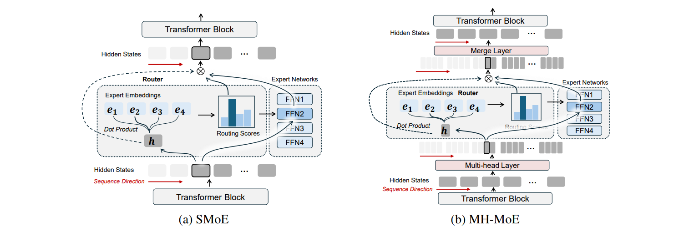

# Multi-Head Mixture of Experts

[](https://arxiv.org/abs/2404.15045)

Official implementation of "**Multi-Head Mixture of Experts**" based on torchscale (https://github.com/microsoft/torchscale) and fairseq (https://github.com/facebookresearch/fairseq)

 [Xun Wu](https://yushuiwx.github.io/), [Shaohan Huang](https://buaahsh.github.io/)<sup>$+$</sup>, [Wenhui Wang](https://scholar.google.com/citations?user=45XvCHUAAAAJ), [Shuming Ma](https://shumingma.com/), [Li Dong](http://dong.li/), [Furu Wei](https://thegenerality.com/)


## Abstract
> Sparse Mixtures of Experts (SMoE) scales model capacity without significant increases in training and inference costs, but exhibits the following two issues: (1) Low expert activation, where only a small subset of experts are activated for optimization. (2) Lacking fine-grained analytical capabilities for multiple semantic concepts within individual tokens. We propose Multi-Head Mixture-of-Experts (MH-MoE), which employs a multi-head mechanism to split each token into multiple sub-tokens. These sub-tokens are then assigned to and processed by a diverse set of experts in parallel, and seamlessly reintegrated into the original token form. The multi-head mechanism enables the model to collectively attend to information from various representation spaces within different experts, while significantly enhances expert activation, thus deepens context understanding and alleviate overfitting. Moreover, our MH-MoE is straightforward to implement and decouples from other SMoE optimization methods, making it easy to integrate with other SMoE models for enhanced performance. Extensive experimental results across three tasks: English-focused language modeling, Multi-lingual language modeling and Masked multi-modality modeling tasks, demonstrate the effectiveness of MH-MoE.



## Updates

- [04/2024] Paper released.
- [09/2024] MH-MoE is accepted by NeurIPS2024.
- [09/2024] Pre-training code released.

## Getting Started

### Installation

```
# Docker for running on V100
sudo docker run -it -v ~:/home -v /data:/data --rm --runtime=nvidia --ipc=host --privileged yushuiwx/nvcr:v23.03.1-v100

# pip install
git clone https://github.com/yushuiwx/MH-MoE.git
cd MH-MoE
bash scripts/setup.sh
```

### Pre-training
```
# run the MH-MoE
bash scripts/run.sh 16 1 moe8-top1-freq2-random-6e-4 512 6e-4 8 1 2 "--moe-second-expert-policy random --moe-ffn-dim 2048"
```
## Citation
If our work is useful for you, please consider citing our paper:
```
@article{wu2024multi,
  title={Multi-head mixture-of-experts},
  author={Wu, Xun and Huang, Shaohan and Wang, Wenhui and Wei, Furu},
  journal={arXiv preprint arXiv:2404.15045},
  year={2024}
}
```
